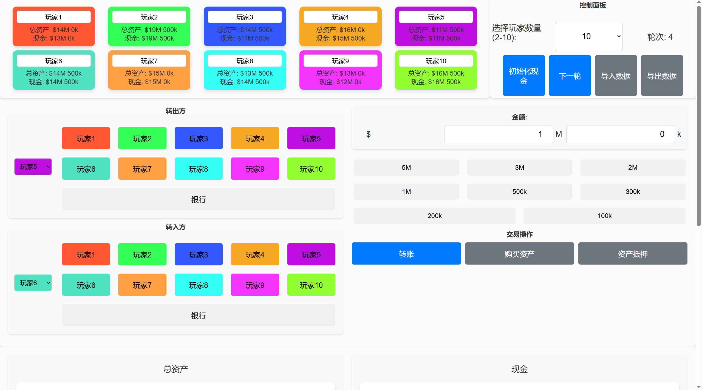

# Momoney
[English](README.md) | [中文](README_CN.md)

## Project Overview
This is a wealth management system for the Momoney game, allowing players to manage cash, assets, transactions, and history records. The system provides charts to display players' total assets and cash changes, and supports data import and export.




## Features
- Initialize cash for players and the bank
- Record transactions and asset changes for each round
- Display charts for players' total assets and cash
- Support data import and export
- Provide detailed operation logs

## File Structure
- `index.html` - Main page containing the UI structure
- `style.css` - Stylesheet defining the page styles
- `main.js` - Main script file containing the primary logic and event handling
- `scripts/` - Contains script files for various functionalities
  - `chart.js` - Handles chart updates and rendering
  - `dataIO.js` - Handles data import and export
  - `logManager.js` - Manages operation logs
  - `modelManager.js` - Manages the display and closing of modal windows
  - `playerManager.js` - Manages player initialization and updates
  - `transaction.js` - Handles transaction logic

## Installation and Running
1. Clone the project locally:
    ```bash
    git clone https://github.com/yourusername/monopoly.git
    ```
2. Open the `index.html` file in your browser to run.

## Usage Instructions
1. Open the page and select the number of players (2-10).
2. Click the "Initialize Cash" button to set the initial cash for each player.
3. Use the control panel to proceed to the next round, transfer money, buy assets, and mortgage assets.
4. Import and export data to save and load game progress.

## Contribution
Feel free to submit issues and pull requests to improve this project. For more details, please refer to the [Contribution Guide](CONTRIBUTING.md).

## License
This project is licensed under the MIT License. For more details, please refer to the [LICENSE](LICENSE) file.